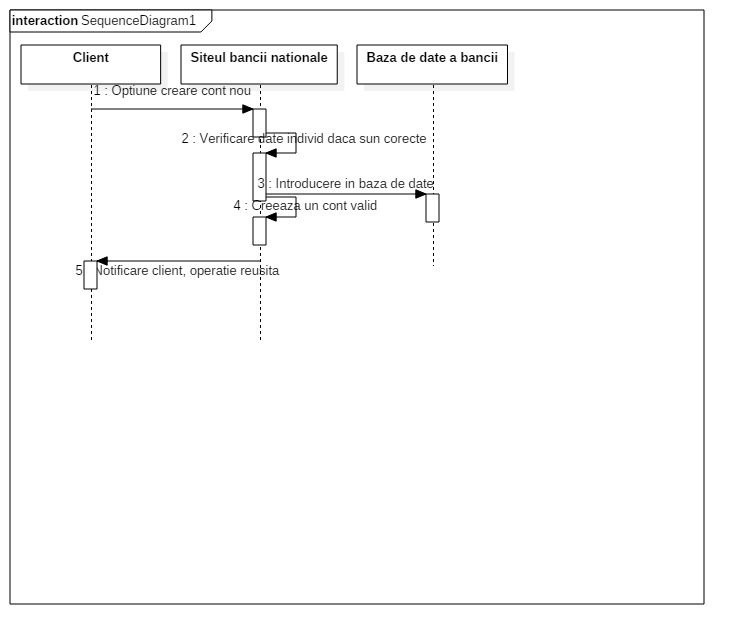

# Ex2 :

# Ex3 :

# Ex4 :
Rolul diagramelor de secventa este de a arata utilizarea obiecetelor create in timp real si interactiunea prin metode intre ele.
Aceste obiecte pot avea legaturi sincronizate sau nesincronizate, care au o ordine bine definita in timp.
Legaturile pot fi dupa cum am zis asincrone, sincrone, feedback-uri (replay-uri), pot trimite mesaje (create message), pot sterge mesaje (delete message).

